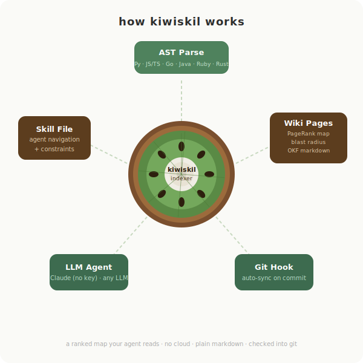

<p align="center">
  
</p>

<h1 align="center">kiwiskil</h1>

<p align="center">
  <strong>Your codebase, understood by any LLM.</strong><br/>
  Generate a checked-in wiki and skill files from any repo — no cloud, no lock-in.
</p>

<p align="center">
  <a href="https://pypi.org/project/kiwiskil/"></a>
  <a href="https://pypi.org/project/kiwiskil/">=3.11"/></a>
  <a href="https://opensource.org/licenses/MIT"></a>
  <a href="https://pypi.org/project/kiwiskil/"></a>
  <a href="https://xysq.ai"></a>
</p>

<p align="center">
  <a href="#install">Install</a> · <a href="#quick-start">Quick start</a> · <a href="#claudemd-snippet">CLAUDE.md snippet</a> · <a href="#cli">CLI</a> · <a href="#loading-the-skill">Loading the skill</a> · <a href="#configuration">Configuration</a> · <a href="CONTRIBUTING.md">Contributing</a>
</p>

---

<p align="center">
  
</p>

kiwiskil generates a checked-in structural wiki and skill files from any codebase. It enables LLM agents to navigate code without reading source files — using a knowledge graph built from your repo and checked into git.

---

## How it works

1. **AST parsing** extracts symbols, imports, and call graphs from your source files (deterministic, free) — Python, JS/TS, Go, Java, Ruby, and Rust
2. **An LLM** adds one-line descriptions and a system overview — via any LiteLLM provider, or your logged-in `claude` CLI with **no API key** ([details](#no-api-key-use-your-logged-in-claude))
3. **A density-based grouper** organises files into wiki pages by logical density, not directory structure
4. **Relationships and impact are rendered inline** — every page shows each symbol's callers, callees, and an "editing this affects…" blast radius (precomputed, deterministic), so an agent can trace and debug without reading source
5. **A ranked repo map** (PageRank over the call graph, fit to a token budget) leads `INDEX.md` and the skill file with the most load-bearing symbols first
6. **A pre-commit hook** keeps the wiki in sync — every commit includes updated wiki pages atomically
7. **A skill file** is generated at `.indexer/skills/codebase.md`, and `init` writes both `CLAUDE.md` and `AGENTS.md` navigation snippets so any LLM agent or assistant can use the map

The wiki is plain markdown checked into your repo, with [OKF](https://cloud.google.com/blog/products/data-analytics/how-the-open-knowledge-format-can-improve-data-sharing)-style YAML frontmatter on every page. No cloud service, no search index, no running server, no lock-in — the map is files an agent reads directly.

---

## Install

```bash
pip install kiwiskil
```

---

## Quick start

```bash
# In any git repo
kiwiskil init       # creates .indexer.toml, installs pre-commit hook, writes CLAUDE.md + AGENTS.md
kiwiskil run        # generates wiki/ and .indexer/skills/codebase.md
```

On every subsequent commit, the pre-commit hook runs `kiwiskil run --staged` automatically — only changed files are re-indexed.

---

## CLAUDE.md / AGENTS.md snippet

`kiwiskil init` writes this navigation snippet to **both** `CLAUDE.md` (for Claude Code) and `AGENTS.md` (the cross-tool convention read by Cursor, Codex, Gemini CLI, Copilot, and others) automatically. `kiwiskil run --smart` also restores either file if it goes missing. If you prefer to add it manually, paste it into the file in your repo root:

```markdown
## Codebase Navigation

This repo is indexed with kiwiskil. Before reading any source file or answering any code question:

1. Load `.indexer/skills/codebase.md` as a skill — it contains the full navigation workflow.
2. Read `wiki/INDEX.md` for the system overview and module map.
3. Match the question to a wiki page, look up symbols there, and only read source when you know the exact file and line range.

Do not read source files speculatively. The wiki gives you structure and relationships in a fraction of the tokens.

- Wiki pages: `wiki/` — grouped by logical density, not directory structure
- Manifest: `.indexer/manifest.json` — maps every file to its wiki page and component IDs
- Component IDs: `relative/path.py::ClassName.method_name`
```

The snippet does three things:
- Tells Claude to load the skill **before** doing anything — this is what makes the navigation workflow kick in
- Points to `wiki/INDEX.md` as the first read, not random source files
- Sets the rule: wiki first, source only when you know exactly where to look

---

## CLI

```bash
kiwiskil init                    # set up config, hook, CLAUDE.md + AGENTS.md
kiwiskil run                     # smart incremental + deep enrichment (default)
kiwiskil run --skip-deep         # skip narrative/flows/constraints enrichment (faster)
kiwiskil run --force             # force full re-index of all files
kiwiskil run --staged            # incremental on staged files only (used by hook)
kiwiskil run --smart             # verify generated artifacts and repair only what's broken
kiwiskil run --smart --dry-run   # report drift without fixing
kiwiskil status                  # show last indexed commit, stale files, stats
kiwiskil hook install            # manually install pre-commit hook
kiwiskil hook remove             # remove pre-commit hook
```

### Deep mode

By default, `kiwiskil run` performs a **deep enrichment** pass after structural indexing. This uses your configured LLM to generate:

- **System narrative** — a plain-English overview of what the codebase does
- **Key request flows** — end-to-end data flows across modules
- **Design constraints** — per-module gotchas, invariants, and non-obvious rules

These appear in `wiki/INDEX.md` and in the skill file, giving agents richer context without reading source. Use `--skip-deep` to run structural-only indexing when speed matters.

### Smart mode

`kiwiskil run --smart` is a verify-then-repair mode for the generated artifacts themselves. It checks for drift that the default incremental mode doesn't catch:

- Missing or deleted wiki pages
- Orphan wiki pages (no manifest entry points to them)
- Missing `.indexer/skills/codebase.md` or `wiki/INDEX.md`
- Dangling manifest entries for files that no longer exist
- Untracked source files that were never indexed
- Missing CLAUDE.md or AGENTS.md snippet, `.gitignore` cache entry, or pre-commit hook
- Wiki pages missing deep-mode sections (when deep mode is enabled)

Smart mode also **fills** missing pieces, not just drift: on a fresh repo with no index yet, `kiwiskil run --smart` performs a full initial index of every tracked source file (it only bails when there are genuinely no indexable files). Never-indexed tracked files are picked up and indexed in the same pass.

Smart mode only re-LLMs the groups it has to. Pass `--dry-run` to see what's drifted (including "would do a full initial index of N files") without changing anything. With `--dry-run`, the command **exits non-zero when drift is found** and zero when clean — making it a drop-in CI drift-gate (see `.github/workflows/kiwiskil.yml`). The dry-run is deterministic and needs no LLM / API key.

---

## Output

### `wiki/INDEX.md`
Top-level map of the entire codebase — which wiki page covers which files, entry points for each group, system overview, and key request flows (when deep mode is enabled). It also carries:
- **Repo Map** — symbols ranked by importance (PageRank over the call graph), fit to a token budget (`map_tokens`), most load-bearing first — read these to orient
- **Core abstractions** — the highest-connectivity symbols (most callers + callees)

Every page is [OKF](https://cloud.google.com/blog/products/data-analytics/how-the-open-knowledge-format-can-improve-data-sharing)-framed: YAML frontmatter with `type`, `title`, `description`, `tags`, `timestamp`, and `resource`; `INDEX.md` declares `okf_version`.

### `wiki/<group>.md`
One page per logical folder cluster. Each page contains:
- **Modules** — files covered
- **Key Symbols** — functions, classes, methods with one-line descriptions
- **Symbol Relationships** — per symbol: its **Callers**, its **Calls**, and **Editing this affects** (the transitive blast radius) — so you can trace and assess impact without reading source
- **Relationships** — what this group calls, what calls it, what it imports
- **Entry Points** — symbols with no callers (architectural roots)
- **Data Flows** — end-to-end flows through this module *(deep mode)*
- **Design Constraints** — invariants and non-obvious rules to respect *(deep mode)*

### `.indexer/skills/codebase.md`
A skill file that teaches any LLM agent how to navigate your codebase. The skill file includes:

- Codebase stats (symbol count, file count, index date, commit)
- System overview and key request flows
- A ranked **Repo Map** (most load-bearing symbols first, fit to a token budget)
- Wiki page index with entry points
- Critical constraints extracted per module
- Step-by-step navigation workflow for agents
- Component ID format reference and manifest lookup instructions

---

## Loading the skill

The skill file lives at `.indexer/skills/codebase.md` after you run `kiwiskil run`. Load it into your agent once — it activates automatically on any codebase question.

### Claude Code

```bash
# Global — available in every project
mkdir -p ~/.claude/skills/codebase
cp .indexer/skills/codebase.md ~/.claude/skills/codebase/SKILL.md

# Project-local — available in this repo only
mkdir -p .claude/skills/codebase
cp .indexer/skills/codebase.md .claude/skills/codebase/SKILL.md
```

Or reference it directly in `CLAUDE.md` (already done by `kiwiskil init`):

```markdown
## Codebase Navigation
Load `.indexer/skills/codebase.md` as a skill before reading source files.
```

### Cursor

Add the skill content to your `.cursor/rules` file or a `*.mdc` rule file:

```bash
# Append the skill as a project rule
cat .indexer/skills/codebase.md >> .cursor/rules/codebase.mdc
```

Or in Cursor Settings → Rules → Project Rules, paste the contents of `.indexer/skills/codebase.md`.

### Windsurf

Add the skill to your project's Windsurf rules file:

```bash
# Append to existing rules, or create the file
cat .indexer/skills/codebase.md >> .windsurfrules
```

Windsurf loads `.windsurfrules` automatically for every conversation in the project.

### GitHub Copilot (VS Code)

Add the skill as a custom instruction file:

```bash
mkdir -p .github
cat .indexer/skills/codebase.md >> .github/copilot-instructions.md
```

Copilot picks up `.github/copilot-instructions.md` automatically for workspace-scoped chat.

### Zed

Paste the skill content into your project's `.zed/assistant_instructions.md`:

```bash
mkdir -p .zed
cat .indexer/skills/codebase.md >> .zed/assistant_instructions.md
```

### Any other agent / MCP client

The skill file is plain markdown. Load it into your agent's context however it supports custom instructions — system prompt, context file, instruction file, or rules file. The skill activates on any codebase navigation question automatically.

---

### Keeping the skill in sync

The pre-commit hook regenerates `.indexer/skills/codebase.md` on every commit. If you copy the file to a global location, re-copy it after each index run:

```bash
kiwiskil run && cp .indexer/skills/codebase.md ~/.claude/skills/codebase/SKILL.md
```

For project-local paths (`.claude/skills/codebase/SKILL.md`, `.cursor/rules/`, `.windsurfrules`), the file updates in-place automatically — no extra step needed.

---

## Configuration

`.indexer.toml` is created by `kiwiskil init` and checked into the repo:

```toml
[llm]
provider = "anthropic/claude-sonnet-4-6"  # any LiteLLM-compatible model string
api_key_env = "ANTHROPIC_API_KEY"         # env var name, not the key itself; leave unset to use the logged-in `claude` CLI

[indexer]
wiki_dir = "wiki"
ignore = ["node_modules", ".venv", "dist", "build", "__pycache__", "*.test.*"]
max_tokens_per_batch = 8000
merge_threshold = 2       # min files under a folder before it becomes its own wiki page
map_tokens = 1024         # token budget for the ranked Repo Map spine in INDEX/skill

[hooks]
pre_commit = true
synthesize_commit_message = true
deep = true           # set false to skip --deep on commits (faster, structural only)
```

Any LiteLLM-compatible provider works: OpenAI, Anthropic, Gemini, Ollama, local models.

### No API key? Use your logged-in Claude

If you have the [`claude` CLI](https://claude.com/claude-code) installed and signed in (Claude Code / a Claude subscription), kiwiskil works with **no API key at all** — just run `kiwiskil run`. When no key is found and the provider is Anthropic, kiwiskil shells out to your authenticated `claude` CLI for the enrichment calls. Credential priority:

1. An explicit API key (`api_key_env` / a known env var) → used directly.
2. Otherwise, Anthropic provider + `claude` on your `PATH` → your logged-in session (zero config, no key).
3. Neither → kiwiskil still emits a **structural** wiki (symbols, call graph, repo map, blast radius); only the LLM-written descriptions and the system-overview prose are skipped.

High-volume symbol descriptions use a fast model (Haiku); the few deep-mode prose calls use your configured model.

---

## Commit message synthesis

When running as a pre-commit hook, kiwiskil synthesises a commit message from the code changes and prints it to stdout. You can use it, edit it, or ignore it — your choice.

---

## Design principles

- **Structural facts only** — wiki pages contain symbols, relationships, and entry points. No prose summaries, no architectural opinions. The client LLM draws its own conclusions.
- **Checked in, not served** — the wiki is plain markdown in your repo. It travels with your code, is tracked by git, and is readable by humans and agents alike.
- **Incremental by default** — git diff + content hash manifest means only changed files are re-processed on each commit.
- **Provider-agnostic** — LiteLLM means you can use any model, local or cloud, without changing the tool.

---

## Supported languages

| Language | Status | Parser |
|----------|--------|--------|
| Python | Supported | stdlib `ast` |
| JavaScript (`.js`, `.jsx`, `.mjs`, `.cjs`) | Supported | tree-sitter |
| TypeScript (`.ts`, `.tsx`) | Supported | tree-sitter |
| Go (`.go`) | Supported | tree-sitter |
| Java (`.java`) | Supported | tree-sitter |
| Ruby (`.rb`) | Supported | tree-sitter |
| Rust (`.rs`) | Supported | tree-sitter |

Coverage varies by language (e.g. Go methods are emitted by their own name rather than attributed to a receiver type). A file whose grammar isn't installed degrades gracefully — it's skipped with a warning, never a crash.

---

## License

MIT
