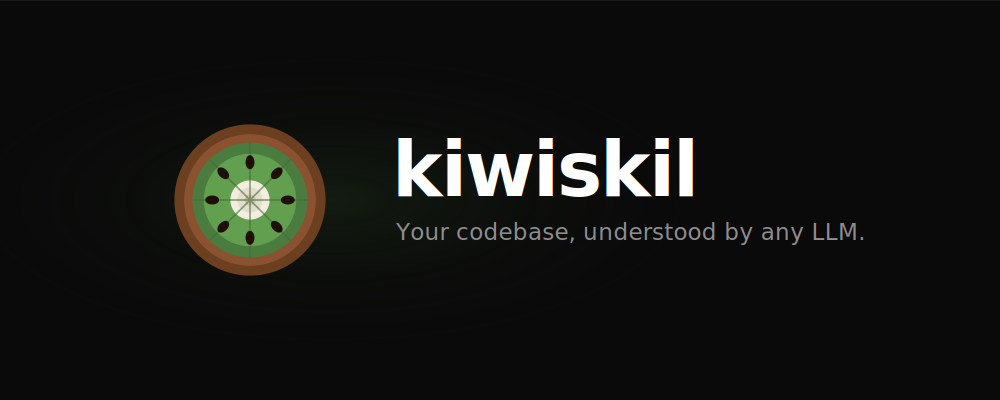
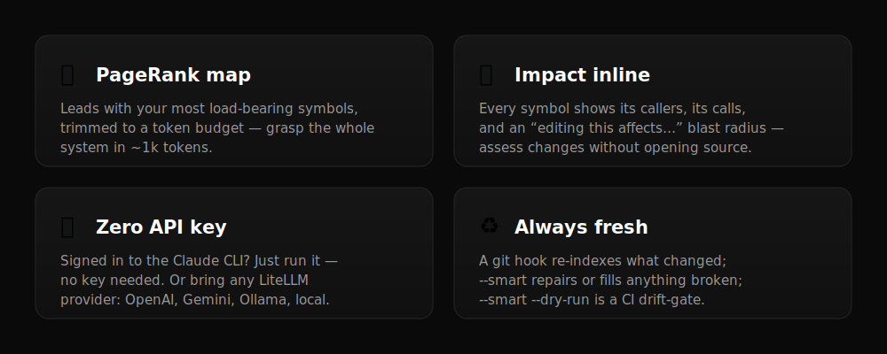
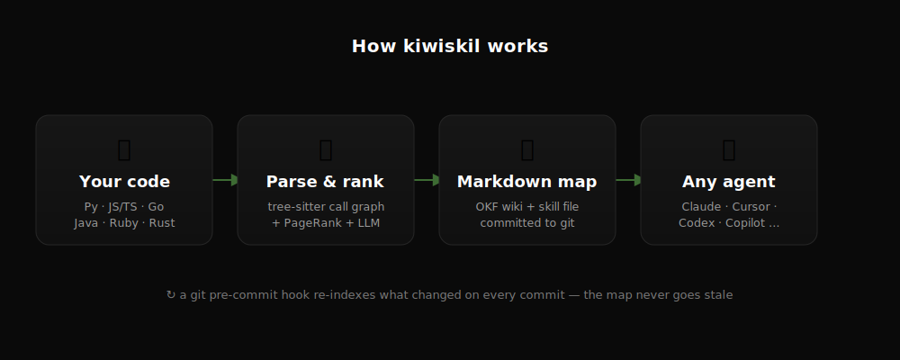

<p align="center">
  
</p>

<p align="center">
  A ranked, checked-in map any AI agent reads instead of crawling your source — no cloud, no lock-in.
</p>

<p align="center">
  <a href="https://pypi.org/project/kiwiskil/"></a>
  <a href="https://pypi.org/project/kiwiskil/">=3.11"/></a>
  <a href="https://opensource.org/licenses/MIT"></a>
  <a href="https://pypi.org/project/kiwiskil/"></a>
  <a href="https://xysq.ai"></a>
</p>

<p align="center">
  <a href="#why-kiwiskil">Why</a> · <a href="#install">Install</a> · <a href="#quick-start">Quick start</a> · <a href="#what-you-get">What you get</a> · <a href="#cli">CLI</a> · <a href="#configuration">Configuration</a> · <a href="CONTRIBUTING.md">Contributing</a>
</p>

---

**kiwiskil turns any codebase into a static, checked-in map that any AI agent can navigate and debug — fast, and with a fraction of the tokens of reading source.** It parses your code into a call graph, ranks what matters with PageRank, and writes it all to plain markdown in your repo. No cloud service, no vector database, no running server, no lock-in — the map is just files an agent reads directly, and a git hook keeps it current.

---

## Why kiwiskil

Code-context tools tend to be either **dumb committed blobs** (whole-repo dumps) or **smart graphs behind a service** (vector/graph DBs you have to run). kiwiskil is the missing third thing — **a smart, ranked, relational map that's just committed files.**

<p align="center">
  
</p>

Also: [OKF](https://cloud.google.com/blog/products/data-analytics/how-the-open-knowledge-format-can-improve-data-sharing)-native markdown (+ [SCIP](https://github.com/sourcegraph/scip) IDs for IDE interop), and six languages — Python, JS/TS, Go, Java, Ruby, Rust — via tree-sitter, no build step.

---

## How it works

<p align="center">
  
</p>

---

## Install

```bash
pip install kiwiskil
```

## Quick start

```bash
# in any git repo
kiwiskil init       # config + git hook + CLAUDE.md / AGENTS.md
kiwiskil run        # build the map → wiki/ + .indexer/skills/codebase.md
```

That's it. Every commit re-indexes what changed automatically. No API key needed if you're signed in to the [`claude` CLI](https://claude.com/claude-code).

## What you get

- **`wiki/INDEX.md`** — a system overview, key flows, the **PageRank repo map** (most load-bearing symbols first), and the core abstractions.
- **`wiki/<group>.md`** — per module: symbols with one-line descriptions, and each symbol's **callers, calls, and blast radius** ("editing this affects…").
- **`.indexer/skills/codebase.md`** — a skill file that teaches any agent to navigate via the map instead of reading source.
- **`.indexer/manifest.json`** — every file → its wiki page and component IDs (with SCIP descriptors).

All plain markdown, [OKF](https://cloud.google.com/blog/products/data-analytics/how-the-open-knowledge-format-can-improve-data-sharing)-framed, checked into your repo. See this repo's own [`wiki/`](wiki/) for a live example.

## CLI

```bash
kiwiskil run                     # incremental + deep enrichment (default)
kiwiskil run --force             # full re-index
kiwiskil run --skip-deep         # structural only, faster
kiwiskil run --smart             # verify + repair/fill anything broken or missing
kiwiskil run --smart --dry-run   # report drift only; exits non-zero → CI drift-gate
kiwiskil status                  # last indexed commit, stale files, stats
```

## Configuration

`.indexer.toml` (created by `init`):

```toml
[llm]
provider = "anthropic/claude-sonnet-4-6"  # any LiteLLM model; leave api_key_env unset to use the claude CLI
api_key_env = "ANTHROPIC_API_KEY"

[indexer]
map_tokens = 1024          # token budget for the ranked repo map
merge_threshold = 2        # min files under a folder before it gets its own page

[hooks]
pre_commit = true
deep = true                # narrative / flows / constraints (set false for speed)
```

**No API key?** If the `claude` CLI is installed and signed in, kiwiskil uses your session — zero config. Otherwise any LiteLLM provider works (OpenAI, Gemini, Ollama, local). With no LLM at all, you still get the full *structural* map (symbols, call graph, repo map, blast radius); only the written descriptions are skipped.

## Languages

Python, JavaScript/TypeScript, Go, Java, Ruby, Rust — via tree-sitter, no build step. A file whose grammar isn't installed is skipped gracefully, never a crash.

## Loading the skill

Point your agent at `.indexer/skills/codebase.md` — it's plain markdown that activates on any codebase question. `kiwiskil init` already wires up `CLAUDE.md` and `AGENTS.md`; for other tools, drop the file into your rules/instructions path (`.cursor/rules/`, `.windsurfrules`, `.github/copilot-instructions.md`, …).

## License

MIT · backed by [xysq.ai](https://xysq.ai)
